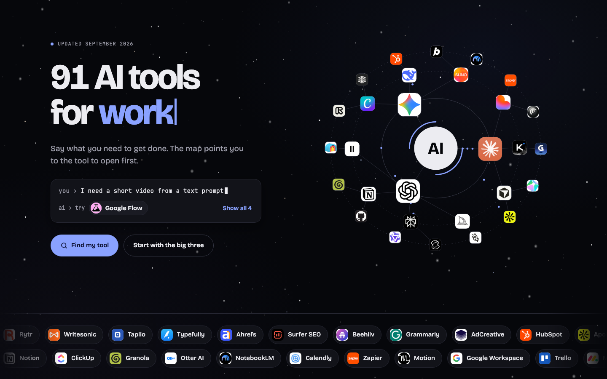

# AI Tools for Work

[](https://ai-tools.ranbot.online)


[](LICENSE)

A single-page map of 91 AI tools for work. Pick what you need to get done, and the page tells you which tool to open first.



**Live:** <https://ai-tools.ranbot.online>

## Contents

- [About](#about)
- [Features](#features)
- [Getting started](#getting-started)
- [Project structure](#project-structure)
- [How the page works](#how-the-page-works)
- [Editing the tool list](#editing-the-tool-list)
- [Browser support](#browser-support)
- [Troubleshooting](#troubleshooting)
- [Contributing](#contributing)
- [License](#license)
- [Author](#author)

## About

There are now hundreds of AI products, and most "top tools" lists are long, unsorted and hard to act on. This page organizes 91 of them by the job you're trying to do, such as building a presentation, finding sales leads or cleaning up call audio. For each job it points to the one tool to try first.

The site is plain HTML, CSS and native JavaScript modules. There's no framework, no package manager and no bundler: the build is a clean copy of `src/` into `dist/`.

## Features

- **Find by task:** 42 tasks in 10 work areas. Choosing a task lists the matching tools in recommended order and marks the first one **Try first**.
- **The big three:** Claude, ChatGPT and Gemini have their own cards at the top. Each card links straight to the product's desktop app, coding agent and web version.
- **Search and filters:** Search covers tool names, descriptions, web addresses and task names. Press `/` to jump to the search box and `Esc` to clear it. The filter chips narrow the list to one work area.
- **Stars:** Star any tool to keep a personal shortlist. Stars are saved in your browser's `localStorage` only, under the key `ai-tools-stars`.
- **Animated header:**
  - An orbit of tool logos that you can hover and click to open each site
  - A demo prompt that types a request and suggests a tool
  - A headline that cycles through work areas
- **Night-sky background:** Three layers of stars that shift at different speeds as you scroll or move the mouse, a few twinkling stars and an occasional shooting star.
- **Accessible motion:** With the system's Reduce Motion setting on, the orbit turns at about a third of normal speed, and the typing, twinkling and shooting stars stay still. Search, filters, tasks, stars and every tool link work with the keyboard. The logos in the orbit are mouse-only, but each of those tools is also listed on the page.

## Getting started

### Prerequisites

| Tool | Needed for | Check |
| --- | --- | --- |
| A modern browser | Viewing the page | See [Browser support](#browser-support) |
| Python 3 | Serving the page locally | `python3 --version` |

Python 3 ships with macOS and most Linux distributions.

### Run it locally

The page loads its scripts as ES modules, which browsers only run over `http://`, not from a file opened directly. Build `dist/` and serve it:

```bash
cd ai-tools
./build.sh
python3 -m http.server 8000 --directory dist
```

Open <http://localhost:8000>. While editing, you can also serve `src/` directly (`--directory src`) and skip the build.

## Project structure

```
ai-tools/
├── src/                  # The site source: the only files you edit
│   ├── index.html        # Page markup and <head>; loads styles.css and js/main.js
│   ├── styles.css        # All styles; design tokens are defined on :root
│   ├── js/
│   │   ├── main.js       # Entry point: starts every module below
│   │   ├── data.js       # All content: work areas, tools, big-three links, tasks
│   │   ├── utils.js      # Shared helpers: DOM, escaping, icons, logos, canvas, animation loop
│   │   ├── render.js     # Page state, cards, search and filters, stars, click and keyboard handling
│   │   ├── hero.js       # Cycling headline word and the demo prompt
│   │   ├── orbit.js      # The header logo orbit
│   │   ├── sky.js        # The night-sky background
│   │   └── effects.js    # Logo strip and the tilt on the big three cards
│   └── logos/            # 91 tool logos, 96×96 PNG, one per tool id (e.g. logos/cursor.png)
├── build.sh              # Copies src/ to dist/
├── dist/                 # Build output (generated, git-ignored, safe to delete)
├── docs/
│   └── screenshot.png
├── README.md
└── LICENSE               # MIT
```

The modules depend on each other in one direction only: `data.js` and `utils.js` import nothing, every other module imports from them, and `main.js` imports the rest.

## How the page works

All content comes from four exports in `src/js/data.js`. Nothing else needs to change when you edit them.

| Array | What it holds |
| --- | --- |
| `CATS` | The 10 work areas: `id`, display `name`, `tag` (the short tagline) and `icon` (SVG path data). `king` is the big three. |
| `TOOL_ROWS` | One row per tool: `[id, name, category, url, description, maker]`. Exported as `TOOLS`, with each row turned into an object. |
| `KING_LINKS` | Extra buttons on the three big cards: `[label, url]` pairs |
| `TASKS` | Each task: `id`, `cat`, `label` and an ordered list of tool ids. The first id is the **Try first** pick. |

Tools per work area:

| Area | Tools | Area | Tools |
| --- | --- | --- | --- |
| The big three | 3 | Productivity | 11 |
| Marketing | 10 | Programming | 12 |
| Sales | 10 | AI Assistants | 10 |
| Design | 12 | Agents & Browsers | 5 |
| Video | 12 | Audio & Voice | 6 |

`render.js` renders everything from these on load, and again whenever you search, filter, choose a task or star a tool. All filter changes go through one function, `setFilters()`. Nothing is fetched at runtime except the fonts and the logo images.

## Editing the tool list

### Add a tool

1. **Add a row to `TOOL_ROWS`** in `src/js/data.js`, in the right work area. The `id` must be unique, lowercase and URL-safe:

   ```js
   ['granola','Granola','prod','https://www.granola.ai','Bot-free meeting notes: it listens on your laptop and cleans up your notes','Granola'],
   ```

2. **Add its logo** as `src/logos/<id>.png`. This fetches the site's icon and resizes it to 96×96 (macOS):

   ```bash
   id=granola; domain=granola.ai
   curl -sL -o "src/logos/$id.png" "https://www.google.com/s2/favicons?domain=$domain&sz=128"
   sips -s format png -Z 96 "src/logos/$id.png" >/dev/null
   ```

   Open the file and check it. Some sites only return a generic globe or a 16px icon. If so, try the site's `/apple-touch-icon.png` or another of its domains. If a logo is missing, the card falls back to the tool's initials.

3. **Optional: add it to a task.** Put its id in a task's `tools` list. The first id is the recommended pick:

   ```js
   { id: 'meetings', cat: 'prod', label: 'Meeting notes', tools: ['granola','otter','gworkspace'] },
   ```

The hero counts ("91 AI tools"), the footer counts and the area totals update automatically.

### Add a task

Add an object to `TASKS` in `src/js/data.js` with a unique `id`, the `cat` it belongs under, a short `label` and an ordered `tools` list. To include it in the header's demo prompt, add a `[taskId, sentence]` pair to `DEMOS` in `src/js/hero.js`.

### Change what's in the header orbit

The three rings are defined in `RINGS` in `src/js/orbit.js`, as lists of tool ids from the inside out:

```js
{ r: .23,  speed: .16,  size: .1,   ids: ['claude','chatgpt','gemini'] },
{ r: .355, speed: -.1,  size: .062, ids: ['kimi','cursor','midjourney', /* … */] },
{ r: .445, speed: .065, size: .05,  ids: ['gamma','heygen','apollo', /* … */] }
```

The orbit plays once: it turns for 60 seconds, eases into reverse, then slows to a stop at about 93 seconds. To change that, edit `T_FWD`, `T_FLIP`, `T_REV` and `T_END` in the same file.

## Browser support

The page targets current evergreen browsers:

| Browser | Minimum | Notes |
| --- | --- | --- |
| Chrome / Edge | 111+ | Full support, including the scroll-in reveals |
| Safari | 16.2+ | Everything works; sections appear without the scroll-in reveal |
| Firefox | 113+ | Everything works; sections appear without the scroll-in reveal |

These versions come from the features the page uses: native ES modules, CSS `color-mix()`, canvas `roundRect()` and scroll-driven animations (Chrome and Edge only). Everything is readable without the animations.

## Troubleshooting

**The header orbit turns slowly, or the typing and shooting stars don't move.**
Your system has Reduce Motion turned on, and the page deliberately calms its animation. On macOS, turn it off in System Settings → Accessibility → Display → Reduce motion, then reload.

**The page is blank when opened by double-clicking `index.html`.**
Browsers don't run ES modules from `file://`. Serve it instead; see [Run it locally](#run-it-locally).

**A logo shows letters instead of an image.**
`src/logos/<id>.png` is missing or its name doesn't match the tool's `id`. See [Add a tool](#add-a-tool).

## Contributing

1. Make your change in `src/`. Most edits only touch `src/js/data.js` (and `src/logos/` for a new tool).
2. Preview it with `./build.sh` and the local server above.
3. Check the page at desktop and phone width: nothing should overflow sideways, and the browser console should show no errors.
4. When adding a tool, link to its official site and keep the description to one line about what it's for.

Tool information (names, links and what each product does) changes quickly. Corrections are welcome.

## License

Released under the [MIT License](LICENSE). © 2026 Encore Shao.

The license covers this project's own code and text. The tool names and the images in `logos/` are trademarks of their respective owners. They're shown only to identify each product and aren't covered by the MIT License.

## Author

Built by **Encore Shao** · <https://ranbot.online>
